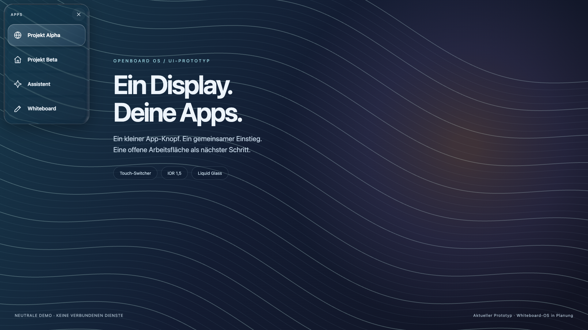
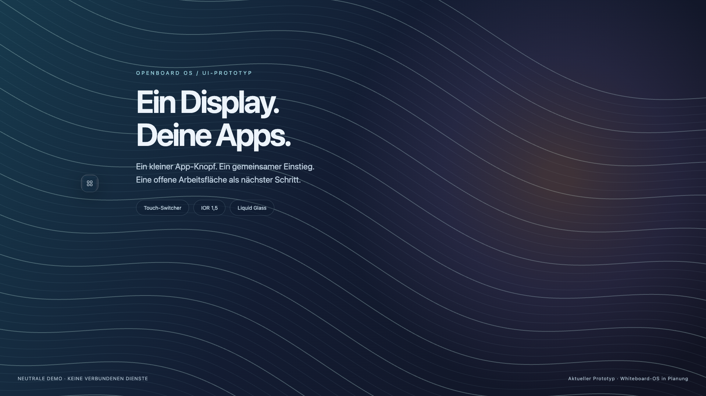
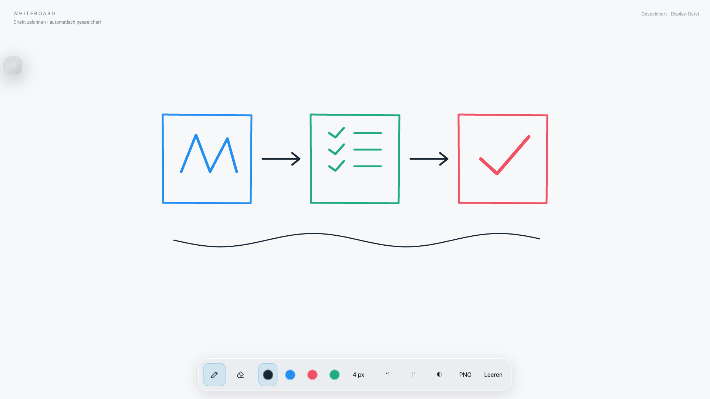

# OpenBoard OS

Eigenständiger Prototyp; nicht mit dem etablierten [OpenBoard](https://github.com/OpenBoard-org/OpenBoard) verbunden.

Ein früher Prototyp auf dem Weg zu einem offenen **Whiteboard-OS**: eine eigene Touch-Arbeitsumgebung für große Displays, in der eigene Apps, Zeichnungen und Projekte zusammenkommen. Ziel ist eine gemeinsame Oberfläche mit schnellen App-Wechseln, Projekt-Arbeitsflächen und geregelter Ressourcenverteilung.

Der heutige Stand ist eine Ubuntu-/X11-Kiosk-Shell mit Liquid-Glass-Switcher, konfigurierbaren Web-App-Tabs, lokalem Whiteboard und privatem Fernzugriff. God’s Eye View, Home Assistant und eine Assistenten-Oberfläche sind Beispiele einer Installation. Sie definieren weder den Zweck des Projekts noch eine feste Beschränkung auf vier Apps. Die aktuelle UI und die Prüfer sind allerdings noch auf diese erste Konfiguration abgestimmt.

## Vision und Entwicklungsstand

Geplant ist eine frei erweiterbare Arbeitsumgebung: eigene Apps hinzufügen, Projekte als Arbeitsflächen speichern und Fenster beziehungsweise App-Flächen passend zu einem großen Touchscreen anordnen. Die Benutzeroberfläche soll Zeichnen, Inhalte und Anwendungen zusammenführen.

| Bereich | Heute | Geplant |
| --- | --- | --- |
| Eigene Apps | URLs über lokale Konfiguration; Switcher mit ersten Beispiel-Apps | Allgemeines App-Verzeichnis, eigene Icons, flexible Zahl von Apps und Projekt-Zuordnung |
| Whiteboard-UI | Lokale Zeichenfläche mit Werkzeugen und Speicherung | Gemeinsame Projekt-Flächen mit Zeichnungen, Materialien und App-Rahmen; Anordnen und Skalieren |
| Windows-/native Apps | Keine entsprechende App-Integration | Adapter für native Linux-Apps und entfernte Windows-Sitzungen; zum Beispiel Windows-VM mit RDP/Guacamole |
| Schnelle Wechsel | Bestehende Browser-Tabs bleiben geladen | Priorisiertes Vorladen, begrenzter Cache, gezieltes Schlafen und Wiederherstellen von Apps |
| Performance | GEV-FPS-/Auflösungsbegrenzung; Glas-Rendering nur in sichtbaren Seiten, ungefähr 7 FPS | Sichtbarkeitsabhängiges Throttling, abgestimmte CPU-/GPU-/RAM-Budgets und nachvollziehbare Messwerte pro App |
| Zustand und Betrieb | Whiteboard-Speicherung, Neustart der Dienste, Netz-/Display-Wiederverbindung | Projektweite Wiederherstellung und portable Sicherungen |

Beim geplanten Ressourcenmanager soll die aktive App Vorrang haben. Unsichtbare Apps sollen je nach Bedarf weiterlaufen, gedrosselt oder pausiert werden. Audio, Datenübertragungen und ungespeicherte Arbeit brauchen eigene Regeln. Caches sollen Größenlimits und kontrollierte Bereinigung erhalten. Diese globale App-Verwaltung ist noch nicht implementiert.

Ähnliche Ansätze existieren bereits, insbesondere SAGE3 mit Apps auf einer gemeinsamen Fläche. Die Recherche samt Funktionen, Grenzen und Lizenzunterschieden steht unter [Ähnliche Projekte](docs/whiteboard-os-research.md).

## Screenshots

Die Bilder zeigen den aktuellen Switcher und das reale Whiteboard-UI mit ausschließlich generierten Beispieldaten. Sie entstehen in einem isolierten Browser gegen einen lokalen Demo-Server, ohne Zugriff auf Konten oder das installierte Display. Die zukünftige Whiteboard-OS-Arbeitsfläche ist darin noch nicht umgesetzt. [Herkunft und Neuerzeugung](docs/screenshots/README.md).

**App-Panel mit neutralen Projekt-Namen**



**Kleiner, verschiebbarer App-Knopf**



**Whiteboard mit Beispielzeichnung**



## Oberfläche

- Kleiner, verschiebbarer App-Knopf (48 × 48 Pixel, Symbol 18 Pixel).
- Transparenter Liquid-Glass-Effekt mit Snell-Lichtbrechung (IOR 1,5), RGB-Dispersion und Fresnel-Rändern über den V1-Renderer von `apple-liquid-glass-webgl`.
- Das aufgeklappte App-Panel bleibt oben links und lässt sich nicht verschieben.
- Vier vorgeladene App-Tabs im selben Vollbildfenster. Ein Wechsel aktiviert den vorhandenen Tab.
- Zusätzliche Home-Assistant-Fenster erhalten ebenfalls den Switcher; eingebettete Frames bekommen kein zweites Overlay.
- Home Assistant wird auf 75 % skaliert; der App-Switcher behält seine Touch-Größe.
- Der Cursor wird auf X11 und in den App-Seiten ausgeblendet.
- Whiteboard mit Stift, Radierer, Farben, Undo/Redo, PNG-Export und lokaler Speicherung.

Über GEV und Whiteboard verzerrt der Glass-Renderer die Canvas-Pixel direkt unter dem Knopf beziehungsweise Panel. Über gewöhnlichen HTML-Seiten verwendet er einen lokalen DOM-Painter; dessen Darstellungsgrenzen sind unten dokumentiert. CSS-Backdrop ergänzt den Effekt. Ein einfarbiger Hintergrund liefert entsprechend wenig sichtbare Lichtbrechung. Die WebGL-Aktualisierung ist auf ungefähr sieben Bilder pro Sekunde begrenzt, um Ressourcen für die aktive App zu lassen.

## Installation

Voraussetzungen: Ubuntu mit Xorg/XFCE, eine funktionierende Touch-Verbindung, Firefox sowie Node.js 24. Die Skripte erwarten dieses Projekt unter `$HOME/mega-display`. GEV wird separat installiert und ist nicht Teil dieses Repositorys.

```bash
# Dieses Repository als ~/mega-display klonen, dann:
cd ~/mega-display
git clone https://github.com/bilawalsidhu/gods-eye-view.git
git -C gods-eye-view checkout 6be25595b16491ce01ffd8d81e66921f321ee200
bash scripts/install-runtime.sh
cd kiosk
PUPPETEER_SKIP_DOWNLOAD=true npm ci
cp config.example.json config.json
cd ..
bash scripts/install-services.sh
bash scripts/install-reconnect-service.sh
```

Pakete für die X11-Steuerung und den optionalen Fernzugriff:

```bash
sudo apt-get install xdotool python3 x11-xserver-utils xinput xfce4-terminal xfce4-screensaver x11vnc curl
bash scripts/install-remote-services.sh
```

Eine automatische Desktop-Anmeldung muss im Display-Manager separat eingerichtet werden. Die Installationsskripte richten XFCE-Autostart und Dienste ein, ändern aber keine Login-Zugangsdaten. Der Browser-Launcher verwendet vorhandenes System-Chrome unter `/opt/google/chrome/chrome` oder den installierten Firefox. Browser-Sandbox und AppArmor bleiben aktiv.

## Einrichtung und Bedienung

`http://localhost:4180/settings` auf dem Display-Rechner konfiguriert den optionalen Gemini-Key sowie Home-Assistant- und Assistenten-URLs. Ohne echte Assistenten-URL zeigt Astra einen lokalen Platzhalter. Native GEV-Sprachsteuerung wird in GEV selbst eingerichtet; der Gemini-Adapter ist eine separate Kiosk-Funktion. Sprachsteuerung setzt ein Mikrofon und einen passenden Provider-Key voraus.

Den kleinen App-Knopf antippen, um das Panel zu öffnen; nur diesen Knopf zum Verschieben ziehen. Seine Position wird zwischen den Apps synchronisiert und lokal gespeichert. Das Panel schließt nach zwölf Sekunden. Eine Drei-Finger-Bewegung vom Bildschirmrand öffnet es ebenfalls, sofern der Touch-Controller mehrere Kontakte unterstützt.

**Ctrl+Alt+Shift+K** beendet den Kiosk für Wartungsarbeiten. Erneut starten:

```bash
bash ~/mega-display/scripts/start-kiosk.sh
```

Die Karte verwendet einen Zielwert von 30 FPS und eine Render-Skalierung von 0,8. Die tatsächliche Bildrate hängt von Grafikchip, Browser und Szene ab.

## Fernzugriff

Die Fernansicht und VNC hören ausschließlich auf Loopback (6080 beziehungsweise 5900). Sie dürfen nicht direkt ins LAN oder Internet veröffentlicht werden. Der SSH-Tunnel übernimmt die Zugriffskontrolle; VNC hat innerhalb dieses lokalen Tunnels kein separates Passwort.

```bash
ssh -N -L 16080:127.0.0.1:6080 USER@DISPLAY_HOST
```

Danach `http://localhost:16080/` öffnen. Die Fernansicht bietet App-Wechsel, Desktop, Terminal, Kiosk-Start und lokale API-Einrichtung. Nach einer unterbrochenen VNC-Verbindung versucht sie automatisch eine neue Verbindung. Ein dauerhafter SSH-Tunnel muss auf dem zugreifenden Rechner separat eingerichtet werden.

## Speicherung und Neustart

Das Whiteboard speichert im Browser und unter `kiosk/data/whiteboard/current.json`. Dateispeicherung erfolgt mit atomarem Austausch und Festplatten-Synchronisierung; vorherige Versionen liegen unter `snapshots/`. Nach fehlgeschlagenen Speicherungen wird erneut versucht. Eine externe Sicherung ist bewusst installationsabhängig und muss separat konfiguriert werden.

Die Browser-Launcher warten auf X11 und die lokalen App-Server. Dienste starten nach Fehlern erneut. Fehlgeschlagene Browser-Netzwerkseiten werden nach einer Wiederverbindung erneut geladen; bereits geladene Apps bleiben erhalten. Der Sharp-Touch-Wächter erkennt Geräte anhand ihres Namens, ordnet aktuelle Eingabe-IDs dem Full-HD-Bildausgang zu und deaktiviert Bildschirm-Blanking.

Bei unterstützten HP-Systemen kann `scripts/setup-power-restore-interactive.sh` nach lokaler Administrator-Authentifizierung ausschließlich die BIOS-Option **After Power Loss → Power On** setzen und zurücklesen. Der Rechner muss diese Option unterstützen. Physischer Kaltstart, Audio und Touch-Gesten müssen auf der konkreten Hardware getestet werden.

## API für Assistenten

Die Steuerung läuft unter `http://127.0.0.1:4180`. Authentifizierung: `Authorization: Bearer TOKEN`; der automatisch erzeugte Token steht ausschließlich lokal in `kiosk/api-token`.

- `GET /api/state`: aktive App und Verbindungszustand.
- `POST /api/tabs/gev/activate`: GEV aktivieren; auch `home`, `astra`, `board` sind möglich.
- `GET /api/gev/tools`: erlaubte GEV-Befehle und ihre Schemas.
- `POST /api/gev/command`: beispielsweise `{"name":"get_current_view_state","args":{}}`.

Beliebiger JavaScript-Code wird nicht als Befehl ausgeführt. Schlüssel gehören nicht in Frontend-Quelltext oder Commits.

## Prüfen

Die Browser-Prüfer laufen innerhalb des Controllers, weil Firefox nur eine WebDriver-BiDi-Sitzung erlaubt. Während der Prüfung den normalen Controller-Dienst stoppen und anschließend wieder starten.

- `node kiosk/server.mjs --verify-startup`: App-Bereitschaft, bestehendes Kiosk-Fenster und Netzwerkwiederherstellung.
- `node kiosk/server.mjs --verify-updates`: vorhandene Tabs, Vollbild, Skalierung und Glass-Renderer.
- `node kiosk/server.mjs --verify-dock`: kleiner Knopf, Verschieben und festes Panel.
- `node kiosk/server.mjs --verify-overlays`: vorhandene zusätzliche Home-Assistant-Fenster und ihre App-Knöpfe prüfen, ohne die Seiten neu zu laden.
- `node kiosk/server.mjs --verify`: vollständiger Funktionstest, der auch einen Whiteboard-Teststrich zeichnet.

Die vollständige Prüfung nur mit entbehrlichen Testzeichnungen ausführen. Prüfberichte und Bildschirmfotos bleiben unter `logs/` und werden nicht versioniert.

## Datenschutz im Repository

Dieses Repository enthält Quellcode, generische Beispielkonfiguration, Abhängigkeiten-Metadaten und drei ausdrücklich freigegebene synthetische Demo-Screenshots. Lokale Konfiguration, API-Token, Provider-Schlüssel, Browserprofile, persönliche Zeichnungen, Sicherungen, Geräteinventar, reale Bildschirmaufnahmen und Logs werden nicht hochgeladen. Reale Hosts und Kontodaten müssen lokal konfiguriert werden. Die PNG-Ausnahmen im Datenschutz-Prüfer sind auf die drei Demo-Dateien begrenzt; sie ersetzen nicht deren visuelle Prüfung.

## Drittanbieter

- [God’s Eye View](https://github.com/bilawalsidhu/gods-eye-view), separat installierter Upstream, auf den oben genannten Commit abgestimmt.
- [Apple Liquid Glass WebGL](https://github.com/Oliverrr2424/webgl-apple-liquid-glass), MIT; Quellen, Lizenz und dokumentierte Anpassungen liegen unter `kiosk/vendor/liquid-glass`. Die Bibliothek rekonstruiert den Apple-Look; sie ist nicht Apples eigener Renderer. GEV/Whiteboard liefern echte Canvas-Pixel einschließlich 48 px Umgebung. Andere Apps verwenden einen lokalen DOM-Painter mit Open-Shadow-DOM-Unterstützung; SVG, Pseudoelemente, Formularfelder und fremde iFrames werden nicht vollständig reproduziert.
- [noVNC](https://github.com/novnc/noVNC), separat heruntergeladen, Commit `a8dfd6a3ea3c74244f5ebdaa5a7f1023007a7820`; die Original-Lizenz bleibt im Download erhalten.
- Puppeteer und ws werden mit dem Lockfile installiert.

Eine mögliche professionelle Whiteboard-Erweiterung ist [Nextcloud Whiteboard](https://github.com/nextcloud/whiteboard). Dieses Repository installiert oder ersetzt keine vorhandene Nextcloud-Instanz.
