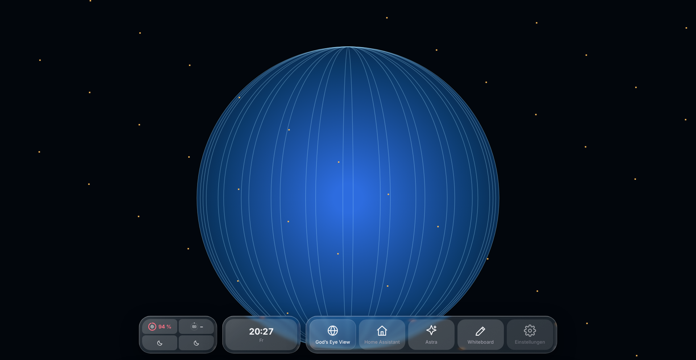
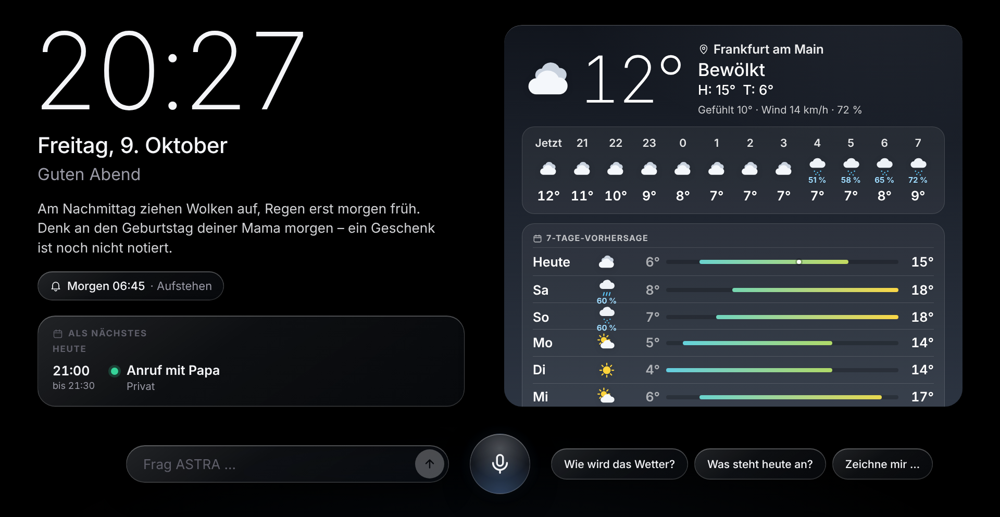
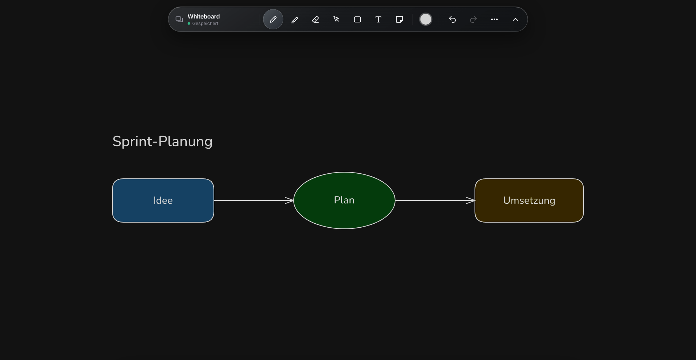
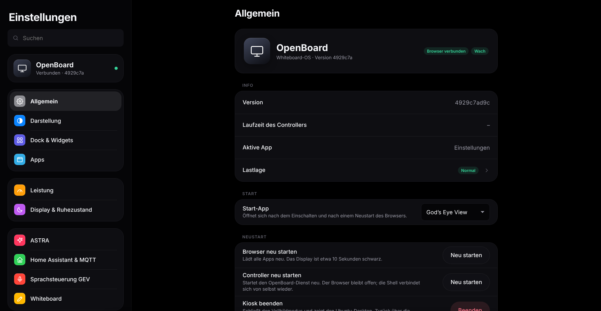

# OpenBoard OS

Eigenständiges Projekt; nicht mit dem etablierten [OpenBoard](https://github.com/OpenBoard-org/OpenBoard) verbunden.

Ein leichtgewichtiges **Whiteboard-Betriebssystem** für große Touch-Displays. Es läuft als Kiosk auf Ubuntu mit X11 und verwandelt einen normalen Rechner mit Touchscreen in ein schnelles, ruhiges Board mit Apps, Dock, Widgets und einem persönlichen KI-Assistenten.

Entwickelt und getestet auf einem Sharp LT60 (60 Zoll, Full HD, Intel HD 630). Alles ist so gebaut, dass es auf schwacher Hardware flüssig bleibt. God's Eye View, Home Assistant und Astra sind Beispiele einer Installation; weitere Web-Apps lassen sich in den Einstellungen hinzufügen.

- **Unsichtbar, bis man es braucht.** Von unten nach oben wischen öffnet das Dock. Sonst gehört der ganze Bildschirm der App.
- **Apps bleiben geladen.** Alle Apps laufen als Tabs in einem Fenster. Ein Wechsel lädt nichts neu.
- **Ein Leistungsmanager mit Verstand.** Solange Reserven da sind, wird nichts angefasst. Unter Last werden ungenutzte Apps erst pausiert und erst zuletzt (auf Wunsch nach Rückfrage) beendet. Home Assistant und Astra bleiben auf Wunsch immer aktiv.
- **Koppelbar.** Home Assistant (MQTT), ASTRA, Webhooks und eine Token-API steuern und beobachten alles.
- **Fernbedienbar.** Eine Konsole im Browser spiegelt Einstellungen, Dock-Editor und Monitoring, ohne VNC-Verzögerung.
- **Selbst aktualisierend.** Neue Commits im Repository werden innerhalb einer Minute gezogen, mit automatischem Rollback.

## Screenshots

Die Bilder entstehen im Test mit Headless-Chromium und Attrappen für God's Eye View, Home Assistant und ASTRA. Sie enthalten ausschließlich generierte Beispieldaten, keine Konten und kein reales Display. [Herkunft und Neuerzeugung](docs/screenshots/README.md).

**Dock mit Widget-Kacheln über der Karte (Liquid Glass)**



**Astra: Ruhebild mit Uhr, Wetter und Terminen**



**Whiteboard mit Beispielzeichnung**



**Einstellungen**



## Vision und Entwicklungsstand

Ziel ist eine frei erweiterbare Arbeitsumgebung: eigene Apps hinzufügen, Projekte als Arbeitsflächen speichern und App-Flächen passend zu einem großen Touchscreen anordnen. Die Oberfläche soll Zeichnen, Inhalte und Anwendungen zusammenführen.

| Bereich | Heute | Geplant |
| --- | --- | --- |
| Eigene Apps | Frei konfigurierbare Web-Apps mit Icon, Zoom und Verbleib-Regel; Dock-Anordnung per Editor | Allgemeines App-Verzeichnis und Projekt-Zuordnung |
| Whiteboard-UI | Excalidraw mit eigener Tinten-Ebene, mehrere Boards, Verlauf, Export, Zeichnen durch ASTRA | Gemeinsame Projekt-Flächen mit Zeichnungen, Materialien und App-Rahmen; Anordnen und Skalieren |
| Windows-/native Apps | Keine entsprechende App-Integration | Adapter für native Linux-Apps und entfernte Windows-Sitzungen, zum Beispiel Windows-VM mit RDP/Guacamole |
| Schnelle Wechsel | Alle Apps bleiben geladen; Vorwärmen nach Nutzungsmuster | Begrenzter Cache und Wiederherstellen ganzer Projekte |
| Performance | Leistungsmanager: Lastlage, Pausieren und Beenden mit Rückfrage, Temperaturregelung, Messwerte pro App | Budgets für CPU, GPU und RAM pro App; Audio und ungespeicherte Arbeit als eigene Regeln |
| Zustand und Betrieb | Auto-Update mit Rollback, Neustart der Dienste, Display-Wiederverbindung, Quer-/Hochformat | Projektweite Wiederherstellung und portable Sicherungen |

Ähnliche Ansätze existieren bereits, insbesondere SAGE3 mit Apps auf einer gemeinsamen Fläche. Die Recherche samt Funktionen, Grenzen und Lizenzunterschieden steht unter [Ähnliche Projekte](docs/whiteboard-os-research.md).

## Bedienung

| Geste | Wirkung |
|---|---|
| Vom unteren Rand nach oben wischen | Dock öffnen (schließt nach einigen Sekunden oder per Wisch nach unten) |
| App im Dock lang drücken | Neu laden, Pausieren, Beenden, „Immer aktiv halten" |
| Widget-Kachel lang drücken | Widget-Editor: Widgets hineinziehen, einstellen, entfernen |
| Tastatur an einer Ecke ziehen | Größe ändern (wird gemerkt) |
| Display tippen (Ruhezustand) | Aufwecken |

**Dock und Widgets.** Links vom Dock liegen Kacheln mit bis zu vier Widgets: CPU, GPU, RAM, Temperatur, Netzwerk, Uhr, Wetter, nächster Termin, Schnellaktionen (Ruhezustand, Design, Ausrichtung, Lautstärke, Helligkeit), freie Home-Assistant-Auslöser, Webhooks und feste ASTRA-Aufträge. Alles ist austauschbar.

**Bildschirmtastatur.** Erscheint automatisch bei Eingabefeldern, auch in Home Assistant und anderen Apps.

**Quer- und Hochformat.** In den Einstellungen unter „Display & Ruhezustand", per Widget oder aus Home Assistant. Das Bild und die Touch-Koordinaten werden gedreht.

**Ruhezustand.** Schwarzbild (Apps pausieren, Touch weckt) oder Signal aus. Automatisch nach Leerlauf oder nach Zeitplan; per Dock, API oder Home Assistant.

## Apps

- **Whiteboard.** Basiert auf [Excalidraw](https://github.com/excalidraw/excalidraw) mit einer eigenen Tinten-Ebene für minimale Stift-Verzögerung (eigener Canvas, vorhergesagte Punkte, `pointerrawupdate`). Mehrere Boards, Verlauf zum Zurückholen, Export als PNG, SVG und `.excalidraw`. ASTRA kann Text, Diagramme (Mermaid), Bilder und Skizzen auf das Board setzen.
- **Astra.** Die Oberfläche für deinen KI-Agenten [ASTRA](https://github.com/ProfessorEngineergit/ASTRA): Ruhebild mit Uhr, Wetter und Terminen, Gespräch per Sprache oder Text, Antwortkarten (Wetter, Kalender, Listen, Bilder, Skizzen), Wecker und Briefing.
- **God's Eye View.** Die Weltkarte aus dem separaten Projekt (siehe Installation), mit Gemini-Sprachsteuerung.
- **Home Assistant.** Wird auf 75 % skaliert. Links und Fenster öffnen sich im selben Tab, ohne die Seite neu zu laden.
- **Einstellungen.** Native App für alles: Darstellung, Dock, Apps, Leistung, Display, ASTRA, MQTT, Updates, Protokolle.

## Installation

Voraussetzungen: Ubuntu mit Xorg und XFCE, ein funktionierender Touchscreen, Chrome (empfohlen) oder Firefox, Node.js 22 oder neuer. Die Skripte finden das Projekt selbst, der Ordner ist frei wählbar.

```bash
git clone https://github.com/ProfessorEngineergit/mega-display-kiosk.git openboard
cd openboard
git clone https://github.com/bilawalsidhu/gods-eye-view.git
git -C gods-eye-view checkout 6be25595b16491ce01ffd8d81e66921f321ee200
bash scripts/install-runtime.sh        # Node.js 24 lokal und Abhängigkeiten von God's Eye View
cd kiosk && PUPPETEER_SKIP_DOWNLOAD=true npm ci && cd ..
bash scripts/install-services.sh       # Dienste, Autostart, Update-Timer
```

God's Eye View ist ein separates Projekt und nicht Teil dieses Repositorys.

Pakete für Eingabe, Bildschirm und Fernzugriff:

```bash
sudo apt-get install python3 x11-xserver-utils xinput xfce4-terminal xfce4-screensaver x11vnc curl
bash scripts/install-runtime-extras.sh   # optional: GPU-Last (intel_gpu_top) und Helligkeit (ddcutil)
bash scripts/install-remote-services.sh  # optional: Konsole und VNC (nur Loopback)
```

Eine automatische Anmeldung am Desktop muss im Display-Manager eingerichtet werden. Die Skripte ändern keine Zugangsdaten. Browser-Sandbox und AppArmor bleiben aktiv. Während der Kiosk läuft, wird das XFCE-Compositing abgeschaltet (spart etwa ein Bild Stift-Verzögerung) und beim Beenden wiederhergestellt.

**Kiosk beenden:** `Strg+Alt+Umschalt+K`. Neu starten: `bash scripts/start-kiosk.sh`.

## Einrichtung

Alles Weitere in der App **Einstellungen** oder in der Konsole:

- **ASTRA:** Adresse und Display-Token aus dem Admin-Bereich von ASTRA (Seite „Display").
- **Home Assistant:** Adresse der Oberfläche und der MQTT-Broker. OpenBoard meldet sich selbst als Gerät an (Bildschirm, App, Leistungsmodus, Design, Ausrichtung, Sensoren, Auslöser für Automationen).
- **Gemini:** Schlüssel für die Sprachsteuerung der Karte.

Die Konfiguration liegt in `kiosk/config.json` (Vorlage: `kiosk/config.example.json`) und wird beim Start von älteren Versionen übernommen. Geheimnisse werden nie an Browser ausgeliefert.

## Leistungsmanager

1. **Messen** alle 2 Sekunden: CPU, RAM, Temperatur, GPU und pro App Last und Speicher.
2. **Lastlage** mit Verzögerung und Hysterese: normal, erhöht, kritisch.
3. **Maßnahmen** in dieser Reihenfolge und immer umkehrbar:
   - Apps mit „Sparsam" werden im Hintergrund sofort pausiert.
   - Erhöht: länger ungenutzte Hintergrund-Apps werden pausiert (sie laufen beim Öffnen sofort weiter).
   - Kritisch: die teuerste lange ungenutzte App wird beendet, wahlweise nach Rückfrage („God's Eye View belastet das System und ist seit 22 min ungenutzt. Beenden?").
   - Nie betroffen: die aktive App, Apps mit „Immer aktiv" und laufende Sprachsitzungen.
4. **Vorwärmen:** Ein Nutzungsmuster pro Stunde lädt die wahrscheinlich nächste App vor.
5. **Temperatur:** Über der Grenze wird die Karte gedrosselt.

Modi: Eco, Ausgewogen, Maximal. Alle Schwellen sind in den Einstellungen änderbar.

## Fernzugriff

Die Konsole und VNC hören nur auf Loopback (6080 und 5900) und dürfen nicht ins Netz veröffentlicht werden. Der SSH-Tunnel übernimmt die Zugriffskontrolle.

```bash
ssh -N -L 16080:127.0.0.1:6080 USER@DISPLAY_HOST
```

Danach `http://localhost:16080/` öffnen. Übersicht mit Live-Diagrammen und App-Steuerung, Bildschirm-Spiegel, Dock-Editor, alle Einstellungen und Protokolle.

## Updates

`openboard-update.timer` prüft jede Minute (einstellbar) `origin/<branch>`:

1. Bei neuen Commits: Fast-Forward, `npm ci` bei geändertem Lockfile, Syntaxprüfung, Migrationen aus `scripts/migrations/`.
2. Neustart von Controller und Konsole, Gesundheitsprüfung für eine Minute.
3. Bei jedem Fehler: automatischer Rollback auf den vorherigen Stand.

Apps laden dabei nicht neu: Die Shell wird in allen offenen Seiten ausgetauscht, nur die eingebauten Apps mit geänderten Dateien laden neu. Ein Arbeitsverzeichnis mit lokalen Änderungen wird nie angefasst. Der Status steht in den Einstellungen unter „Updates".

## API für Assistenten

Steuerung auf `http://127.0.0.1:4180` mit `Authorization: Bearer TOKEN` (Token in `kiosk/api-token`):

- `GET /api/v1/state`: Zustand aller Apps, Lastlage, Anzeige.
- `POST /api/v1/apps/<id>/activate`: App öffnen (`gev`, `home`, `astra`, `board`, `settings`).
- `POST /api/v1/display/sleep` und `/wake`.
- `POST /api/v1/say` mit `{"text":"…"}`: Text über ASTRA sprechen lassen.
- `POST /api/v1/board/insert`: Inhalte aufs Whiteboard setzen.
- `GET /api/v1/gev/tools`, `POST /api/v1/gev/command`: erlaubte Karten-Befehle.

Beliebiger JavaScript-Code wird nicht ausgeführt. Die vollständige Beschreibung steht in [`docs/ARCHITECTURE.md`](docs/ARCHITECTURE.md).

## Entwickeln und prüfen

```bash
cd kiosk
npm test            # Unit-Tests (Konfiguration, Leistungslogik, Board-Speicher)
npm run test:update # Update-Skript gegen ein Test-Repository, inklusive Rollback
npm run e2e         # kompletter Lauf mit Headless-Chromium und Attrappen (God's Eye View, Home Assistant, ASTRA)
npm run verify      # Live-Prüfung des laufenden Systems (zuerst openboard-control stoppen)
```

Das Whiteboard wird in `kiosk/apps/board` gebaut (`npm ci && npm run build`); `dist/` ist eingecheckt, auf dem Kiosk gibt es keinen Build-Schritt.

## Datenschutz im Repository

Das Repository enthält nur Quellcode, generische Beispielkonfiguration und Abhängigkeiten-Metadaten. Lokale Konfiguration, Token, Schlüssel, Browserprofile, Zeichnungen, Sicherungen, Bildschirmfotos und Logs werden nicht hochgeladen (`python3 scripts/check-repo-privacy.py`).

## Drittanbieter

- [Excalidraw](https://github.com/excalidraw/excalidraw) (MIT), [mermaid-to-excalidraw](https://github.com/excalidraw/mermaid-to-excalidraw) (MIT), [perfect-freehand](https://github.com/steveruizok/perfect-freehand) (MIT), React (MIT)
- [apple-liquid-glass-webgl](https://github.com/Oliverrr2424/webgl-apple-liquid-glass) (MIT), Originalquellen und Änderungen unter `kiosk/vendor/liquid-glass`
- [Inter](https://rsms.me/inter/) (SIL OFL 1.1)
- [noVNC](https://github.com/novnc/noVNC), separat heruntergeladen, Commit `a8dfd6a3ea3c74244f5ebdaa5a7f1023007a7820`
- [God's Eye View](https://github.com/bilawalsidhu/gods-eye-view), separat installiert, Commit `6be25595b16491ce01ffd8d81e66921f321ee200`
- Puppeteer, ws, mqtt (MIT)
